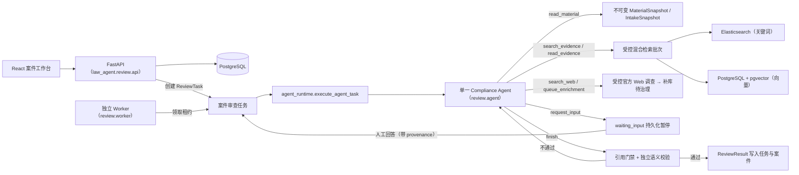

# CrossComply 架构

CrossComply 是企业数据出境合规的**单 Agent** 系统：一个有状态、有预算、可暂停恢复的 Compliance Agent 完成全部调查与报告；程序负责冻结快照、工具门禁、预算、引用校验和外部副作用；正式审批与整改由人完成。

## 运行链路

之后由确定性流程接续：Worker 回写案件状态与整改动作清单 → 人在工作台核实/整改 → 人发起飞书审批 → 验签的审批事件回写终态 → 需要时生成带 SHA-256 的 PDF 决策报告。

## Agent 决定什么

每一轮模型只选择一个动作（`law_agent/review/agent.py` 的 `AgentDecision`），没有固定步骤顺序，可按证据与缺口重复或跳过：

- `propose_plan`：更新对用户可见的简短计划。**计划不暂停运行**，Agent 同一次运行内继续执行；
- `read_material`：分页读取本任务冻结的材料；
- `record_facts`：记录从材料提取的工作事实，不得覆盖已冻结的申请人确认事实；
- `search_evidence`：自生成 1-4 个查询，重复调用受控混合检索（预算 5 次）；
- `read_evidence`：在已检索到的来源内按条号或 chunk 续读完整条款（预算 8 次）；
- `search_web`：仅在受控库不足或需核实时效性时，检索受限官方来源（预算 2 次）；Web finding 只是调查上下文，不能作为 claim 证据；
- `queue_enrichment`：把新官方来源或标记 refresh 的已入库 URL 提交后台补库（每次运行最多 2 条），入库前不具备引用资格；
- `request_input`：阻塞性缺口进入持久化暂停；人工答复带 `provenance`（申报人陈述 / 审查人指引），不自动改写冻结事实；
- `finish`：提交结构化草稿，进入程序门禁。

## 程序保证什么

- **冻结输入不可变**：`MaterialSnapshot`（材料版本 + 解析文本）与 `IntakeSnapshot`（申请人确认事实）一经冻结只能新增版本，Agent 不能修改；补充分改变硬事实时必须重新冻结。
- **固定预算**：16 轮、5 次检索、8 次按来源读取、2 次 Web 搜索、2 条补库提交。预算耗尽只允许以 `insufficient_evidence` 收口。
- **引用门禁**（`agent_tools.ComplianceAgentTools.finalize`）：法律 claim 只能由 `can_cite_clause=true` 的 chunk 支持；材料引用的版本必须属于本次冻结快照且原文唯一精确命中；风险结论非证据不足时至少一条可引用法条。
- **独立语义校验**（`semantic_grounding.SemanticGroundingVerifier`）：另一个模型只依据冻结事实与完整法条逐条核验 claim 与结论；地域/行业适用性不满足判 unsupported，事实不足判 uncertain；不通过则把裁决退回 Agent 补证或修正，不产出报告。
- **时效阻断**：发现可能改变核心结论的新官方材料（`web_impact=core`）时置 `freshness_hold`，不得进入审批。
- **无本地回退**：检索必须同时连通 ES 与 pgvector，服务不可用即显式失败；LLM 节点无 rule-based 兜底。
- **外部副作用不属于 Agent**：Agent 不能发飞书、不能批准、不能激活整改。
- **终态权威**：案件审批终态只能由验签且幂等的飞书事件写回；Worker 失败必须持久化失败节点与原因。

## 人必须完成什么

- 申请人：填报并确认案件要素（IntakeSnapshot），提供冻结材料，回答阻塞性问题；
- 审查人：在工作台核对证据与引用、要求补正、发起飞书审批、验收整改；
- 审批人：在飞书完成通过 / 附条件通过 / 拒绝；
- 知识库管理员：复核 Agent 提交的补库来源，通过治理前新来源不进受控库。

## 持久化与任务状态

- 案件状态机在 `review/workflow.py`：`draft → needs_info → pending_review → review_running → pending_source_verification / pending_feishu_approval → approved / conditionally_approved / rejected`，异常为 `run_failed`。
- `ReviewTask`（PostgreSQL）持有模型 ID、冻结快照引用、租约、预算消耗与完整 `AgentState` checkpoint。任务状态：`queued → running → waiting_input →（重新排队）→ succeeded / failed / superseded`。
- Worker 基于租约单次领取一个任务（默认 2 小时租约），每步保存 checkpoint 与 append-only 的用户可读步骤记录（不保存模型私有思维链）；租约失效后从最近 checkpoint 继续。
- `completion_has_missing_information` 阻止证据不足、仍有缺失信息或时效阻断的结果被提升到审批。

## 代码边界

| 模块 | 身份 |
| --- | --- |
| `law_agent/review/agent_runtime.py` | **生产审查 runtime**：Worker 为一个 ReviewTask 组装 Agent、受控工具与门禁。 |
| `law_agent/review/agent.py` / `agent_tools.py` | Agent 决策循环、预算与全部受控工具、finalize 门禁。 |
| `law_agent/review/worker.py` | 生产 Worker：领任务、调 runtime、持久化成功/暂停/失败、回写案件与整改。 |
| `law_agent/review/service.py` | **检索 benchmark / 离线评测的固定流水线工具**（CLI `run`/`retrieve`、`evalset` runner、专项测试使用）；不是生产 Worker 的执行拓扑。 |
| `law_agent/review/api.py` + `review/http/` | FastAPI 组装与 HTTP 路由适配器；不启动 CLI 子进程。 |

法源如何获得引用资格见 [data-governance-design.md](./data-governance-design.md)；部署与运维事实见 [SERVICE_STACK.md](./SERVICE_STACK.md)。
