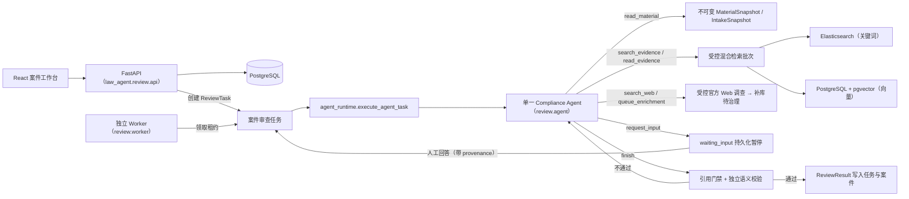

# CrossComply 架构

CrossComply 是企业数据出境合规的**单 Agent** 系统：一个有状态、有预算、可暂停恢复的 Compliance Agent 完成全部调查与报告；程序负责冻结快照、工具门禁、预算、引用校验和外部副作用；正式审批与整改由人完成。

## 运行链路

之后由确定性流程接续：Worker 回写案件状态与整改动作清单 → 人在工作台核实/整改 → 人发起飞书审批 → 验签的审批事件回写终态 → 需要时生成带 SHA-256 的 PDF 决策报告。

## Agent 决定什么

每一轮模型只选择一个动作（`law_agent/review/agent.py` 的 `AgentDecision`），没有固定步骤顺序，可按证据与缺口重复或跳过：

- `propose_plan`：更新对用户可见的简短计划。**计划不暂停运行**，Agent 同一次运行内继续执行；
- `read_material`：分页读取本任务冻结的材料；
- `record_facts`：记录从材料提取的工作事实，不得覆盖已冻结的申请人确认事实；
- `search_evidence`：自生成 1-4 个查询，重复调用受控混合检索（预算 5 次）；
- `read_evidence`：在已检索到的来源内按条号或 chunk 续读完整条款（预算 8 次）；
- `search_web`：仅在受控库不足或需核实时效性时，检索受限官方来源（预算 2 次）；Web finding 只是调查上下文，不能作为 claim 证据；
- `queue_enrichment`：把新官方来源或标记 refresh 的已入库 URL 提交后台补库（每次运行最多 2 条），入库前不具备引用资格；
- `request_input`：阻塞性缺口进入持久化暂停；人工答复带 `provenance`（申报人陈述 / 审查人指引），不自动改写冻结事实；
- `finish`：提交结构化草稿，进入程序门禁。

## 程序保证什么

- **冻结输入不可变**：`MaterialSnapshot`（材料版本 + 解析文本）与 `IntakeSnapshot`（申请人确认事实）一经冻结只能新增版本，Agent 不能修改；补充分改变硬事实时必须重新冻结。
- **固定预算**：16 轮、5 次检索、8 次按来源读取、2 次 Web 搜索、2 条补库提交。预算耗尽只允许以 `insufficient_evidence` 收口。
- **引用门禁**（`agent_tools.ComplianceAgentTools.finalize`）：法律 claim 只能由 `can_cite_clause=true` 的 chunk 支持；材料引用的版本必须属于本次冻结快照且原文唯一精确命中；风险结论非证据不足时至少一条可引用法条。
- **独立语义校验**（`semantic_grounding.SemanticGroundingVerifier`）：另一次模型调用依据审查目标、冻结事实与完整法条逐条核验 claim 与结论，同时接收被引法源的时效与效力元数据，以及本轮已返回、属于治理后法律库的解释辅助资料。`GroundedClaim.text` 的 schema 描述引导模型说明本案事实与法源之间的适用关系，未确认前提保留为条件性判断；不新增输出字段或固定措辞校验。`interpretation_authorities` 保留问答等资料的效力、日期、地域及对象范围，辅助理解法条，不升级为正式法条引用；未检索到的资料不自动注入。地域/行业适用性不满足判 unsupported，必要事实不足判 uncertain；不通过则把裁决退回 Agent 补证或修正，不产出报告。机制选择、整体合规与手续完成按用户目标区分，额外法律断言仍须获得支持。新旧法源冲突由模型依据时点、范围与衔接原文判断，程序不编码门槛或法律路径。

Agent 与语义校验器区分关键条件未知、已确认不满足条件和核实前的审慎建议。条件性判断不要求固定风险等级或必须追问；摘要、主结论、法律路径和问题发现应与事实的确定程度一致。校验不止核对法条转述，也核对事实到个案结论的推导，不能用末尾的条件说明掩盖主结论过度确定。

语义校验的逐项 `claim_checks` 与总评保持一致：模型已判 unsupported/uncertain 的主张不能被总体 supported 放过。程序只收紧矛盾总评并保留具体原因，反馈交给原 Agent 自主补证或修改，没有新增检索执行流程或法律路径规则。要求全部报告片段返回结构化核验结果的方案经[小样本诊断](agent-ab-20261010.md)出现误拦，保留在隔离实验脚本，未加入生产门禁。

主 Agent 和案件追问通过 `LAWAGENT_AGENT_REASONING_EFFORT` 配置思考强度，独立语义校验通过 `LAWAGENT_SEMANTIC_REASONING_EFFORT` 配置，两者默认 low，支持 none/low/high/max。上述节点使用 JSON 输出；其余节点继续使用 `OPENAI_COMPATIBLE_REASONING_EFFORT`（默认 none）。[DeepSeek 思考模式](https://api-docs.deepseek.com/guides/thinking_mode/)支持工具调用，但不支持强制指定工具的 tool_choice；当前 strict_tool 实现使用这种指定方式，因此该模式须使用 none。项目不设置输出 token 上限；供应商自身的默认和模型容量仍然生效。high 作为疑难问题的手动配置选项，不按业务条件自动升级。

主 Agent 使用单轮 `AgentDecision` JSON 决策接口，由程序执行动作，不注册 API tools。提示明确这一区别，避免模型将动作名称输出成工具调用标记或在 JSON 后追加执行描述；解析失败仍按节点既有重试机制处理，不增加宽松解析或兼容层。

处理合法性基础、出境机制、同意及其他保护义务由Agent分别核对一般依据与例外；建议和边界中的假设分支同样接受语义校验，事实变化不会自动取消未改变的例外。程序不编码这些法律结论。历史证据须在审查时点已发布且生效，检索、相邻扩展、读取和最终报告均复查日期；没有生效日期的指南或问答仍受发布时间限制。最终引用只来自实际返回给Agent且该时点可用的证据，不从检索候选缓存补入未展示的内容。

报告的 `material_conflict` 用于两段冻结材料原文之间的矛盾；确认填报或人工陈述与材料不一致且尚待核实时，通过 `missing_information` 说明来源和值以及待核实事项，来源账本保留双方。输出 schema 与结构校验反馈说明这个区别，材料引用仍只允许真实冻结材料，不将事实快照伪装成第二段材料。
- **时效阻断**：发现可能改变核心结论的新官方材料（`web_impact=core`）时置 `freshness_hold`，不得进入审批。
- **无本地回退**：检索必须同时连通 ES 与 pgvector，服务不可用即显式失败；LLM 节点无 rule-based 兜底。
- **外部副作用不属于 Agent**：Agent 不能发飞书、不能批准、不能激活整改。
- **终态权威**：案件审批终态只能由验签且幂等的飞书事件写回；Worker 失败必须持久化失败节点与原因。

## 人必须完成什么

- 申请人：填报并确认案件要素（IntakeSnapshot），提供冻结材料，回答阻塞性问题；
- 审查人：在工作台核对证据与引用、要求补正、发起飞书审批、验收整改；
- 审批人：在飞书完成通过 / 附条件通过 / 拒绝；
- 知识库管理员：复核 Agent 提交的补库来源，通过治理前新来源不进受控库。

## 持久化与任务状态

- 案件状态机在 `review/workflow.py`：`draft → needs_info → pending_review → review_running → pending_source_verification / pending_feishu_approval → approved / conditionally_approved / rejected`，异常为 `run_failed`。
- `ReviewTask`（PostgreSQL）持有模型 ID、冻结快照引用、租约、预算消耗与完整 `AgentState` checkpoint。任务状态：`queued → running → waiting_input →（重新排队）→ succeeded / failed / superseded`。
- Worker 基于租约单次领取一个任务（默认 2 小时租约），每步保存 checkpoint 与 append-only 的用户可读步骤记录（不保存模型私有思维链）；租约失效后从最近 checkpoint 继续。
- `completion_has_missing_information` 阻止证据不足、仍有缺失信息或时效阻断的结果被提升到审批。

## 事实来源与确认

`ReviewFacts` 是 Agent 的工作事实投影，包括 CIIO 身份、重要数据情况、非敏感与敏感个人信息人数、统计期间、接收地及豁免业务事实。人数保留原始陈述和口径，不由程序按门槛选择法律路径。新任务从冻结 intake 初始化工作事实；恢复时直接使用保存的工作事实和来源账本，不重新初始化。

`AgentState.fact_ledger` 每条仅有 `field / value / source_type / source_ref / status`。新任务从 `IntakeSnapshot` 写入 `confirmed_intake / confirmed`，过滤空值与 unknown，保留 false 和零。confirmed 仅表示申请人确认填报内容，估算、待核实身份、拟采用路径仍保持原本含义，不等于独立核实或法律结论。

`record_facts` 的 `facts` 更新工作事实投影，`material_facts` 独立记录本轮材料观察的字段和值。材料陈述的原值不随工作投影中的 `unknown/under_review` 丢失；程序绑定当前材料快照并写入 `material / extracted`。模型不能指定可信等级或来源 ID；材料归因仍须语义校验器核对原文。同字段、同来源、同值去重，历史观测不随工作投影清空而删除。窄冲突只检测 intake 与材料的严格相反布尔值，以及 CIIO/非 CIIO、重要/非重要两个明确身份枚举；不推断名称、文本、人数口径之间的语义冲突。

`request_input` 可附带 `fact_questions`，声明待询问字段与回答类型。申请人可先记录结构化回答，或自行明确选择要更正的业务字段。回答和对应值始终为 `applicant_statement / unverified`，来源绑定本次 gate；编辑待确认内容不消耗 Agent 推理预算。自由文本回答仍可继续原任务，reviewer/admin 的回答只作为操作指引，不写事实账本。

申请人点击“确认这些事实并继续审查”后，服务器核对案件所有权、当前任务、材料与事实版本、gate、回答修订号及确认值。在同一事务中写回 intake、新增同材料版本的事实快照、关闭旧 waiting task 并排新审查任务。任何排队失败均回滚整组写入；重复或过期确认被拒绝。明确确认生成的快照指纹同时绑定前一事实快照，改回历史值也会形成新版本，不复用已经结束的旧任务。当前闭环限于 `needs_info` 案件，正在运行、进入审批或已有审批决定的案件不能借此改写事实。确认值未变化时直接继续原任务。

账本随 checkpoint 和最终 result JSON 保存，无新增数据库表。语义 verifier 同时接收账本、冻结 intake 与 human_inputs；空账本不意味着没有历史来源。与材料一致且不存在具体矛盾的确认填报，可以作为明确限定前提的法律判断输入，不能只因缺少独立核实证明而重新列为未知；它也不证明事实已经客观核实。真实冲突或法律必要事实缺失仍须澄清。前端以已确认填报、材料发现、冲突、未确认补充说明呈现，内部 source/status 仅在审核人的来源详情展开。

## 案件持续问答

`matter_agent.py` 提供独立的解释与调查能力，绑定当前 ReviewTask、MaterialSnapshot 与 IntakeSnapshot。输入仅包含该版本的冻结材料、来源账本、工作事实、通过语义校验的正式报告，以及报告实际引用且具有引用资格的受控证据。人工输入和对话记录必须明确标记来源，缺少来源时拒绝继续，不补造来源。申请人对话中的结构化事实建议以事件 ID 为来源、unverified 为状态加入只读账本视图；不写回任务工作事实。审核人的对话继续作为操作指引。历史对话按同一任务隔离，作为数据而非事实授权。

回答中的法源 claim 必须引用该证据集；材料引用必须属于当前冻结版本并唯一精确命中原文；最终回答复用独立语义 verifier，并传入法源的地域与行业适用范围。当前法源库缺少原证据、正文变化或引用资格已撤销时拒绝回答。无新增 Web 调查或补库副作用；材料与上下文总长度超过 120000 字符时明确拒绝，不暗中截断。用户的假设只用于条件性解释，不改写实际案件事实。

问答只新增 `matter_agent_turn` 案件事件，不修改正式报告、审批、任务或确认事实。模型返回后再次核对输入版本，版本已变化则不保存回答。新实际事实可整理为待确认建议，申请人明确确认后才进入上述冻结与重新审查闭环；需要补充且已完成的任务通过对话事件 ID 绑定确认内容。前端 conversation hook 按案件与输入版本隔离异步结果，切换版本清空当前对话显示，历史事件仍保留审计记录。

## 代码边界

| 模块 | 身份 |
| --- | --- |
| `law_agent/review/agent_runtime.py` | **生产审查 runtime**：Worker 为一个 ReviewTask 组装 Agent、受控工具与门禁。 |
| `law_agent/review/agent.py` / `agent_tools.py` | Agent 决策循环、预算与全部受控工具、finalize 门禁。 |
| `law_agent/review/fact_confirmation.py` / `transactions.py` | 明确确认、冻结事实与任务替换的原子业务流程；HTTP 路由仅做权限与输入适配。 |
| `law_agent/review/matter_agent.py` | 绑定案件版本的只读问答与证据门禁。 |
| `law_agent/review/worker.py` | 生产 Worker：领任务、调 runtime、持久化成功/暂停/失败、回写案件与整改。 |
| `law_agent/review/service.py` | **检索 benchmark / 离线评测的固定流水线工具**（CLI `run`/`retrieve`、`evalset` runner、专项测试使用）；不是生产 Worker 的执行拓扑。 |
| `law_agent/review/api.py` + `review/http/` | FastAPI 组装与 HTTP 路由适配器；不启动 CLI 子进程。 |

法源如何获得引用资格见 [data-governance-design.md](./data-governance-design.md)；部署与运维事实见 [SERVICE_STACK.md](./SERVICE_STACK.md)。
